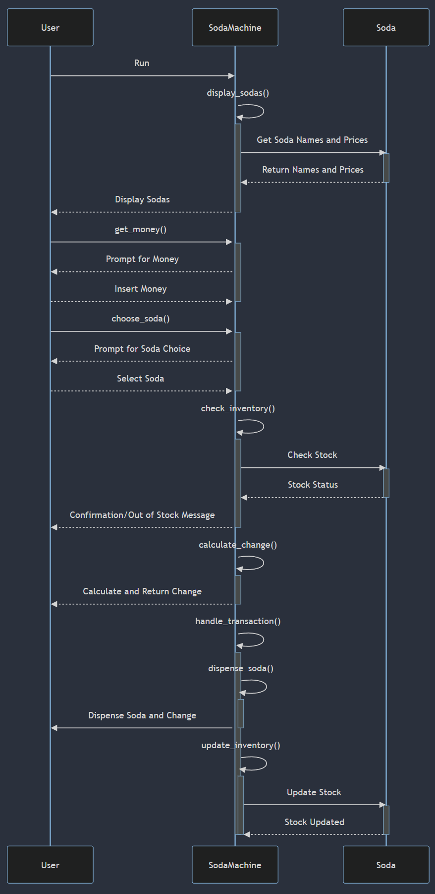

# Soda Machine Simulator

## Introduction
The Soda Machine Simulator is a Python-based interactive program that simulates the operation of a soda vending machine. It allows users to select, purchase sodas, and handles transactions including stock management and change calculation.

## Features
- **Selection of Sodas**: Choose from a variety of sodas like Coke, Pepsi, Sprite, and Dr. Pepper.
- **Realistic Transaction Handling**: Simulates the process of inserting money, selecting a soda, and receiving change.
- **Stock Management**: Keeps track of the stock levels of each soda.
- **Error Handling**: Gracefully handles invalid inputs and out-of-stock scenarios.
- **Random Malfunction Simulation**: Occasionally simulates a scenario where the machine takes money but doesn't dispense a soda.

## Requirements
To run the Soda Machine Simulator, you need:
- Python 3.x

## Installation
No additional installation is required. The simulator is a standalone Python script.

## Usage
To run the Soda Machine Simulator, navigate to the directory containing `soda_machine.py` and run:

`python soda_machine.py`

Follow the on-screen prompts to insert money, select a soda, and complete the transaction.

## How It Works
- **Display Sodas**: The machine displays available sodas and their prices.
- **Insert Money**: User inserts money into the machine.
- **Choose Soda**: User selects a soda from the available options.
- **Transaction Processing**: The machine checks if enough money has been inserted and dispenses the soda and any change.
- **Stock Updating**: After a soda is dispensed, its stock is reduced by one.
- **Malfunction Simulation**: There's a 1% chance that the machine will simulate a malfunction, taking the money without dispensing a soda.

## Contributing
Contributions to the Soda Machine Simulator are welcome. Please feel free to fork the repository, make improvements, and submit pull requests.

---

# Interaction Diagram

